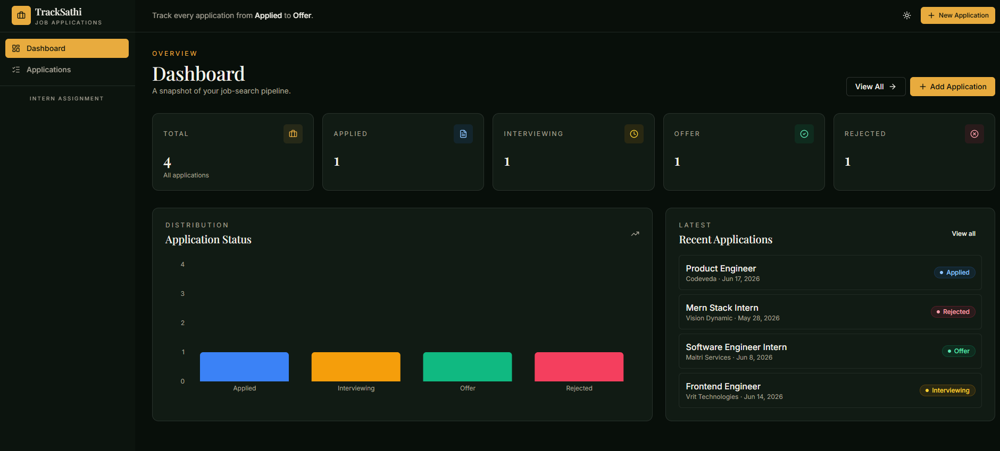
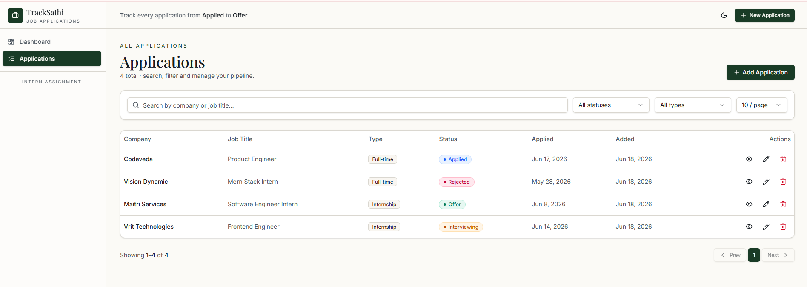
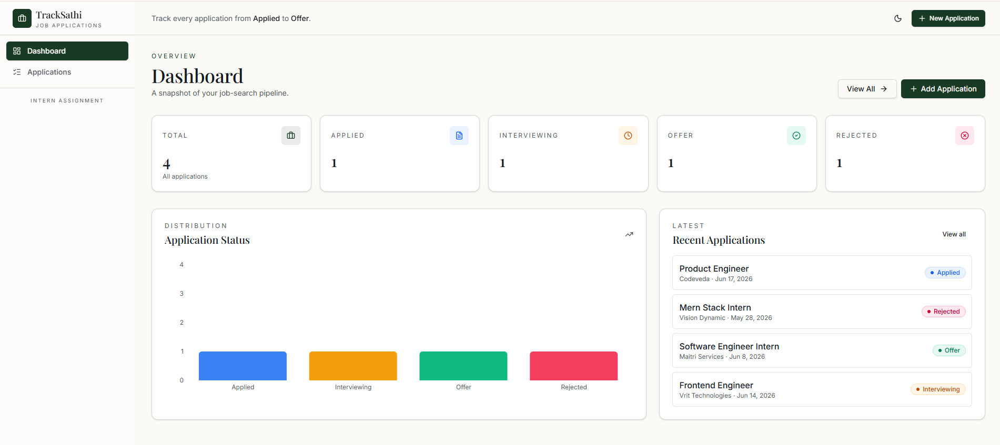
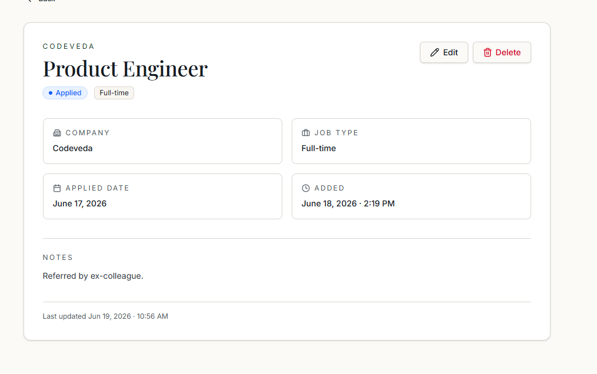
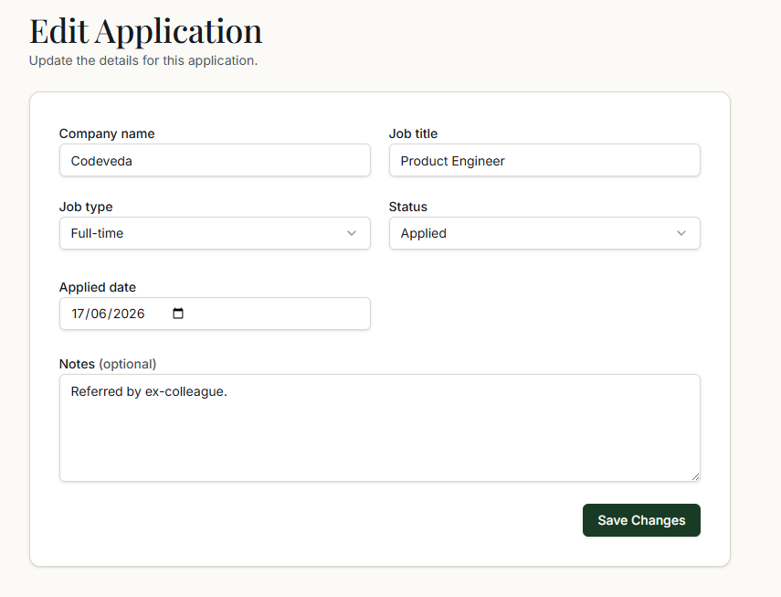
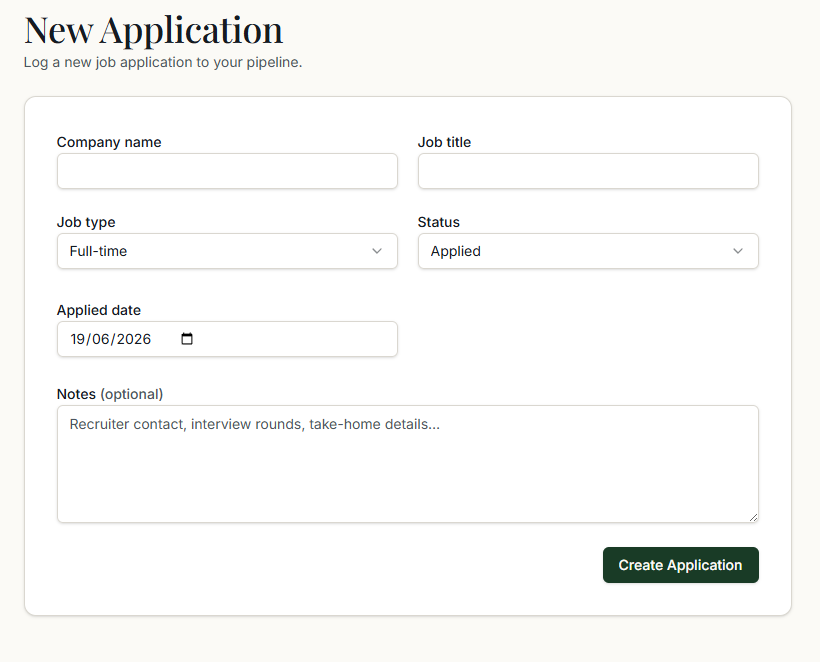

# TrackSathi — Job Application Tracker

A full-stack job application tracking application built with **TanStack Start**, **React 19**, **Supabase**, and **Tailwind CSS v4**. Track applications from Applied to Offer with a clean, responsive dashboard.

## Tech Stack

| Layer | Technology |
|-------|-----------|
| **Frontend** | React 19, TanStack Router, TanStack Query, Tailwind CSS v4, shadcn/ui |
| **Backend** | TanStack Start (Server Functions + REST API via h3), Nitro |
| **Database** | Supabase (PostgreSQL) with migrations |
| **Validation** | Zod (frontend + backend) |
| **Forms** | react-hook-form + @hookform/resolvers |
| **Language** | TypeScript (strict mode) |

## Features

- Dashboard with statistics by status and bar chart
- List all applications with search, filter, and pagination
- Create, view, edit, and delete applications
- Optimistic UI updates on delete
- Responsive design with dark/light theme
- REST API at `/applications`
- GraphQL API at `/graphql`
- Server-side rendering

## REST API

Base URL: `http://localhost:5173`

| Method | Endpoint | Description |
|--------|----------|-------------|
| `GET` | `/applications` | List applications (`?status=`, `?search=`, `?page=`, `?limit=`, `?jobType=`) |
| `GET` | `/applications/:id` | Get a single application |
| `POST` | `/applications` | Create a new application |
| `PATCH` | `/applications/:id` | Update an application (partial) |
| `DELETE` | `/applications/:id` | Delete an application |

### Example Requests

```bash
# List all applications
curl http://localhost:5173/applications

# Filter by status and search
curl "http://localhost:5173/applications?status=Interviewing&search=Stripe"

# Create an application
curl -X POST http://localhost:5173/applications \
  -H "Content-Type: application/json" \
  -d '{"company_name":"Acme Corp","job_title":"Software Engineer","job_type":"Full-time","status":"Applied","applied_date":"2026-06-18"}'

# Update an application (partial)
curl -X PATCH http://localhost:5173/applications/<uuid> \
  -H "Content-Type: application/json" \
  -d '{"status":"Interviewing"}'

# Delete an application
curl -X DELETE http://localhost:5173/applications/<uuid>
```

## GraphQL API

Endpoint: `POST http://localhost:5173/graphql`

### Queries

```graphql
query ListApplications($page: Int, $limit: Int, $search: String, $status: String, $jobType: String) {
  applications(page: $page, limit: $limit, search: $search, status: $status, jobType: $jobType) {
    rows { id company_name job_title job_type status applied_date notes created_at }
    total page limit
  }
}

query GetApplication($id: ID!) {
  application(id: $id) { id company_name job_title job_type status applied_date notes created_at }
}
```

### Mutations

```graphql
mutation CreateApp($input: ApplicationInput!) {
  createApplication(input: $input) { id company_name job_title job_type status applied_date }
}

mutation UpdateApp($id: ID!, $input: ApplicationUpdateInput!) {
  updateApplication(id: $id, input: $input) { id company_name job_title job_type status }
}

mutation DeleteApp($id: ID!) {
  deleteApplication(id: $id) { success }
}
```

### Example

```bash
curl -X POST http://localhost:5173/graphql \
  -H "Content-Type: application/json" \
  -d '{"query":"{ applications(limit: 5) { rows { company_name job_title status } total } }"}'
```

## Prerequisites

- **Node.js** >= 22.12.0
- **npm** or **bun**
- **Supabase** account (free tier works)

## Installation

1. Clone the repository:

```bash
git clone https://github.com/your-username/trackr.git
cd trackr
```

2. Install dependencies:

```bash
npm install
# or
bun install
```

3. Set up environment variables:

```bash
cp .env.example .env
```

4. Fill in your Supabase credentials in `.env`:

   - Go to [supabase.com](https://supabase.com) → Project → Settings → API
   - Copy `Project URL` → `SUPABASE_URL`
   - Copy `anon public` key → `SUPABASE_PUBLISHABLE_KEY`
   - Copy `service_role` key → `SUPABASE_SERVICE_ROLE_KEY`
   - The `VITE_` prefixed variables should match their non-prefixed counterparts

5. Apply database migrations:

   - Go to your Supabase project → SQL Editor
   - Open and run `supabase/migrations/20260618042205_50f363b3-310d-46c9-a5fa-b5bd3adf0057.sql`

   Or use the Supabase CLI:

```bash
npx supabase login
npx supabase link --project-ref your-project-id
npx supabase db push
```

## Running in Development

```bash
npm run dev
```

The app starts at `http://localhost:5173`.

## Running Tests

```bash
npm test            # Run all tests
npm run test:watch  # Watch mode
```

Tests use Node's built-in test runner with `tsx`. Located at `src/lib/__tests__/`.

## Linting & Formatting

```bash
npm run lint    # ESLint
npm run format  # Prettier
```

## Building for Production

```bash
npm run build
npm run preview
```

## Docker

### Development

```bash
docker compose up
```

The app starts at `http://localhost:5173`.

### Production Build

```bash
docker build --target build -t tracksathi .
docker build --target prod -t tracksathi:prod .
docker run -p 3000:3000 --env-file .env tracksathi:prod
```

## Project Structure

```
src/
├── api/                    # REST + GraphQL API handlers
│   ├── applications.ts
│   └── graphql.ts
├── components/             # React components
│   ├── application-form.tsx # Reusable form (create/edit)
│   ├── app-shell.tsx        # Layout with sidebar
│   ├── delete-dialog.tsx    # Delete confirmation
│   ├── empty-state.tsx
│   ├── stat-card.tsx
│   ├── status-badge.tsx
│   └── ui/                 # shadcn/ui components
├── integrations/
│   └── supabase/
│       ├── client.server.ts # Server-side Supabase client
│       ├── client.ts        # Client-side Supabase client
│       ├── types.ts         # Database type definitions
│       ├── auth-attacher.ts # Auth token middleware
│       └── auth-middleware.ts
├── lib/
│   ├── applications.ts     # Server functions + Zod schemas + Query options
│   ├── error-capture.ts    # Global error capture
│   ├── error-page.ts       # HTML error page
│   ├── theme.tsx           # Dark/light theme
│   └── utils.ts            # cn() helper
├── routes/
│   ├── __root.tsx          # Root layout
│   ├── index.tsx           # Dashboard
│   ├── applications.index.tsx       # List
│   ├── applications.new.tsx         # Create
│   ├── applications.$id.index.tsx   # View
│   └── applications.$id.edit.tsx    # Edit
├── server.ts               # Server entry (SSR + API routing)
├── start.ts                # TanStack Start config
├── router.tsx              # Router + QueryClient
└── styles.css              # Tailwind + custom theme
supabase/
└── migrations/             # Database migration files
```

## Database Schema

```sql
-- Table: applications
-- id: UUID (auto-generated)
-- company_name: TEXT (required)
-- job_title: TEXT (required)
-- job_type: ENUM (Internship, Full-time, Part-time)
-- status: ENUM (Applied, Interviewing, Offer, Rejected)
-- applied_date: DATE (required)
-- notes: TEXT (optional)
-- created_at: TIMESTAMPTZ (auto-set)
-- updated_at: TIMESTAMPTZ (auto-updated via trigger)
```

## Environment Variables

| Variable | Required | Description |
|----------|----------|-------------|
| `SUPABASE_URL` | Yes | Supabase project URL |
| `SUPABASE_PUBLISHABLE_KEY` | Yes | Supabase anon/publishable key |
| `SUPABASE_SERVICE_ROLE_KEY` | Yes | Supabase service role key (server-only) |
| `SUPABASE_PROJECT_ID` | Yes | Supabase project reference ID |
| `SUPABASE_DB_PASSWORD` | Yes | Database password (for CLI) |
| `SUPABASE_ACCESS_TOKEN` | Yes | Supabase access token (for CLI) |
| `VITE_SUPABASE_URL` | Yes | Same as SUPABASE_URL (client-accessible) |
| `VITE_SUPABASE_PUBLISHABLE_KEY` | Yes | Same as SUPABASE_PUBLISHABLE_KEY (client-accessible) |
| `VITE_SUPABASE_PROJECT_ID` | Yes | Same as SUPABASE_PROJECT_ID (client-accessible) |

## Screenshots

| Dashboard | Applications List |
|:---:|:---:|
|  |  |

| Application Detail | Application Form |
|:---:|:---:|
|  |  |

| Filter & Search | Dark Theme | Mobile View |
|:---:|:---:|:---:|
|  |  |  |

## License

MIT
